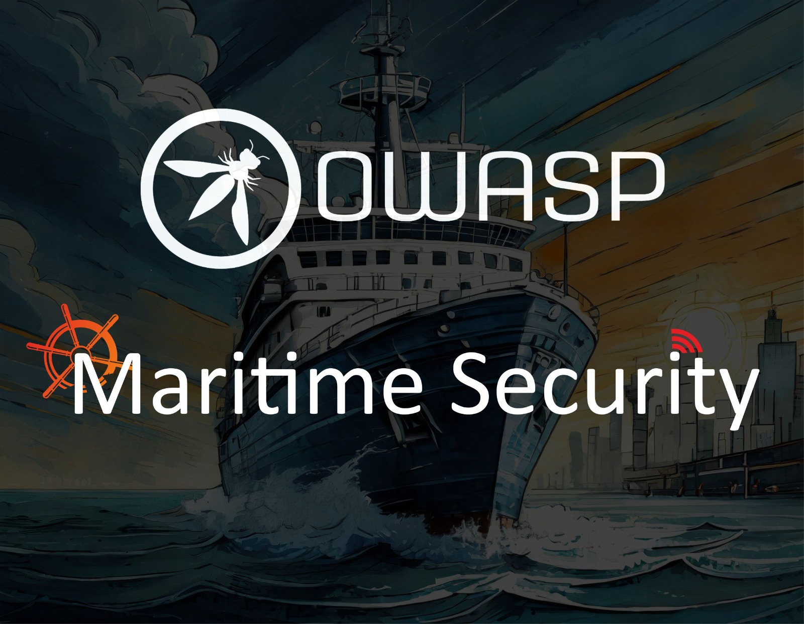

# OWASP Top 10 for Maritime Security - 2025

**Version 1.0 - November 2025**

## Executive Summary

The OWASP Top 10 for Maritime Security represents the most critical cybersecurity risks facing the global maritime industry. This list is based on comprehensive analysis of regulatory guidance, incident data, threat intelligence, and industry reports spanning 2017-2025.

The maritime sector faces unique cybersecurity challenges stemming from:
- Long operational lifecycles of vessels and equipment (20-30+ years)
- Integration of legacy operational technology (OT) with modern IT systems
- Global operations across diverse regulatory jurisdictions
- Critical safety implications of cyber incidents
- Increasing connectivity and digitalization of maritime operations

This Top 10 list provides maritime stakeholders—including shipowners, port operators, classification societies, crew, and regulators—with a prioritized framework for understanding and mitigating cyber risks.

## Methodology

This list was developed using a data-driven methodology adapted from the OWASP Top 10 framework:

- **34 authoritative sources analyzed:** IMO guidelines, USCG alerts, IACS recommendations, DNV GL reports, NIST standards, and industry incident reports
- **12+ documented maritime cyber incidents** studied in detail
- **Risk scoring** based on frequency, impact, exploitability, prevalence, and detection difficulty
- **Maritime-specific weighting** prioritizing safety-critical systems
- **Expert validation** from maritime security professionals

See [METHODOLOGY.md](../methodology/METHODOLOGY.md) for complete analysis framework.

---

## The OWASP Maritime Top 10 - 2025

### MAR-T10-2025-01: Ransomware and Destructive Malware

**Risk Score: 9.2 / 10**

#### Description
Ransomware targeting maritime organizations encrypts critical systems, halting port operations, vessel movements, and corporate functions. Modern ransomware employs double extortion (encryption + data theft) and can spread rapidly across IT and OT networks.

#### Why It's Critical
- **Highest financial impact:** NotPetya cost Maersk $300M+, port disruptions cost millions per day
- **Operational paralysis:** Complete shutdown of terminals, vessel management, cargo systems
- **Safety implications:** Indirect safety impact from loss of operational capabilities
- **Increasing frequency:** Multiple major incidents (Maersk, MSC, COSCO, ports worldwide)

#### Affected Maritime Systems
- Port terminal operating systems (TOS)
- Vessel management and fleet systems
- Cargo handling and tracking systems
- Corporate IT networks
- Email and communication systems
- Financial and administrative systems

#### Real-World Examples
- **Maersk NotPetya (2017):** $300M+ losses, 76 ports affected, 10-day recovery
- **MSC Ransomware (2020):** Multiple offices disrupted
- **Port of San Diego (2018):** Administrative systems encrypted
- **COSCO Americas (2018):** Booking and documentation systems affected

#### Mitigation Strategies
1. **Offline backups** with tested restoration procedures (3-2-1 rule)
2. **Network segmentation** between IT, OT, and external networks
3. **Email security** and anti-phishing training
4. **Patch management** for all systems
5. **Endpoint detection and response (EDR)** solutions
6. **Incident response plan** with ransomware scenarios
7. **Disable or secure RDP** and remote access

#### References
- US Coast Guard Maritime Cyber Alert 02-23 (BLACKBASTA)
- CISA #StopRansomware resources
- IMO MSC-FAL.1/Circ.3/Rev.2

---

### MAR-T10-2025-02: GNSS/GPS Manipulation and Jamming

**Risk Score: 9.1 / 10**

#### Description
Spoofing transmits false GPS signals to deceive navigation systems, while jamming disrupts GPS reception entirely. Both attacks compromise vessel navigation, potentially causing collisions, groundings, or unauthorized route deviations.

#### Why It's Critical
- **Direct safety impact:** Navigation errors can cause casualties, collisions, groundings
- **Widespread occurrence:** Documented in Black Sea, Persian Gulf, South China Sea
- **Difficult detection:** Often undetected until cross-checking position
- **Cascading effects:** Impacts ECDIS, AIS, autopilot, dynamic positioning

#### Affected Maritime Systems
- GPS/GNSS receivers (all constellations)
- Electronic Chart Display and Information Systems (ECDIS)
- Automatic Identification System (AIS)
- Dynamic Positioning (DP) systems
- Autopilot systems
- Timing systems dependent on GPS

#### Real-World Examples
- **Black Sea GPS Spoofing (2017-present):** Ongoing campaign affecting thousands of vessels
- **Persian Gulf Interference (2019-2020):** Jamming during regional tensions
- **South China Sea:** Multiple incidents in disputed waters

#### Mitigation Strategies
1. **Multi-constellation GNSS** (GPS, GLONASS, Galileo, BeiDou)
2. **Alternative navigation methods** (radar, visual, celestial, inertial)
3. **GNSS integrity monitoring** and authentication (where available)
4. **Cross-checking** position with AIS, radar, visual observations
5. **Crew training** on spoofing/jamming indicators
6. **Position verification** procedures before critical maneuvers

#### References
- IMO MSC.1/Circ.1575 - GNSS vulnerabilities
- IACS Rec. 166 - Cyber resilience
- USCG and MARAD navigation warnings

---

### MAR-T10-2025-03: Phishing and Social Engineering

**Risk Score: 8.1 / 10**

#### Description
Targeted phishing campaigns against maritime personnel to steal credentials, deploy malware, or facilitate business email compromise (BEC) and wire fraud. Most common initial attack vector across all industries including maritime.

#### Why It's Critical
- **Highest exploitability:** Low technical skill required, high success rate
- **Initial access vector:** 90%+ of breaches start with phishing
- **Direct financial fraud:** BEC targeting maritime finance departments
- **Gateway to ransomware:** Credential theft enables further attacks
- **Human vulnerability:** Exploits trust and authority

#### Affected Maritime Systems
- Email systems and user accounts
- Authentication and credential stores
- Financial and payment systems
- Any system accessible with stolen credentials

#### Attack Scenarios
- Spear phishing emails impersonating port authorities, agents, customers
- Fake invoice and payment diversion schemes
- Credential harvesting via fake login pages
- Malicious attachments deploying malware
- CEO fraud targeting finance personnel
- Smishing (SMS phishing) to crew and staff

#### Mitigation Strategies
1. **Security awareness training** for all personnel (quarterly minimum)
2. **Email filtering** and anti-phishing technologies
3. **Multi-factor authentication (MFA)** on all accounts
4. **Verification procedures** for financial transactions (dual control)
5. **Simulated phishing exercises** to test and train
6. **Email authentication** (DMARC, SPF, DKIM)
7. **Reporting mechanisms** for suspicious emails

#### References
- CISA Phishing Guidance - Stopping the Attack Cycle
- NIST SP 800-63B - Digital Identity Guidelines
- USCG Maritime Cyber Bulletins

---

### MAR-T10-2025-04: Insecure Remote Access

**Risk Score: 9.4 / 10**

#### Description
Remote access to vessels and port systems for maintenance and monitoring often lacks proper security controls. Weak passwords, unencrypted connections, and inadequate authentication enable unauthorized access and serve as entry points for ransomware and data theft.

#### Why It's Critical
- **Direct route to critical systems:** Remote access bypasses perimeter defenses
- **Ransomware delivery mechanism:** Compromised RDP major attack vector
- **Third-party vendor risk:** Vendor remote access often poorly controlled
- **24/7 exposure:** Internet-facing remote access constantly under attack
- **Satellite communication vulnerabilities:** VSAT connections often unsecured

#### Affected Maritime Systems
- Remote Desktop Protocol (RDP) on vessel and shore systems
- VNC and remote support tools
- Vendor remote maintenance connections
- VSAT satellite communications
- VPN concentrators and remote access gateways

#### Attack Scenarios
- Brute force attacks on RDP with weak/default passwords
- Exploitation of RDP vulnerabilities (BlueKeep, etc.)
- Compromised vendor credentials for system access
- Man-in-the-middle attacks on unencrypted connections
- Persistence mechanisms via remote access tools

#### Mitigation Strategies
1. **Disable RDP** and remote access when not actively needed
2. **VPN with MFA** for all remote access
3. **Strong, unique passwords** and credential management
4. **Network segmentation** and firewall rules
5. **Time-limited vendor access** with approval workflows
6. **Encrypted connections** (TLS/SSH) mandatory
7. **Remote access logging and monitoring**
8. **Jump servers** for administrative access

#### References
- NIST SP 800-46 Rev. 2 - Remote Access Guide
- USCG Maritime Cyber Alerts on RDP attacks
- IMO Guidelines on Cyber Security Onboard Ships

---

### MAR-T10-2025-05: Unpatched and Legacy Systems

**Risk Score: 8.4 / 10**

#### Description
Maritime vessels and facilities operate legacy systems running obsolete, unsupported operating systems and software with known vulnerabilities. Long operational lifecycles (20-30 years) and certification requirements create challenges for patching and upgrades.

#### Why It's Critical
- **Extremely prevalent:** Windows XP/7 still common in maritime OT
- **Known vulnerabilities:** Public exploit code available
- **Compliance challenges:** Certification and warranty concerns with updates
- **Attack facilitator:** EternalBlue exploited in WannaCry and NotPetya
- **Difficult to remediate:** Replacement costs and operational constraints

#### Affected Maritime Systems
- ECDIS running unsupported Windows versions
- Legacy bridge systems and automation
- Outdated programmable logic controllers (PLCs)
- End-of-life vessel management systems
- Unsupported network equipment and firewalls

#### Real-World Examples
- **WannaCry (2017):** Spread via unpatched Windows SMB vulnerability
- **NotPetya (2017):** Exploited EternalBlue on unpatched systems
- Port State Control findings of outdated ECDIS software

#### Mitigation Strategies
1. **Asset inventory** of all systems and software versions
2. **Vulnerability management program** with regular scanning
3. **Patch management policy** with testing and deployment procedures
4. **Network segmentation** to isolate legacy systems
5. **Compensating controls** where patching not possible (firewalls, application whitelisting)
6. **Lifecycle planning** for system upgrades and replacements
7. **Virtual patching** through network security devices

#### References
- NIST SP 800-82r3 - ICS Security Guide
- IACS Rec. 166 - Cyber Resilience
- IMO MSC-FAL.1/Circ.3/Rev.2

---

### MAR-T10-2025-06: Insufficient Network Segmentation

**Risk Score: 8.2 / 10**

#### Description
Lack of proper network segmentation between operational technology (OT), information technology (IT), and external networks allows lateral movement from compromised IT systems to safety-critical OT systems. Flat network architectures common in maritime environments.

#### Why It's Critical
- **IT-to-OT pivot:** Compromised office systems can reach engine controls
- **Malware propagation:** NotPetya spread across Maersk global network
- **Difficult containment:** Flat networks make incident response challenging
- **Regulatory requirement:** Classification societies mandate segmentation
- **Very common deficiency:** Most vessels lack proper segmentation

#### Affected Maritime Systems
- Integrated Bridge Systems (IBS)
- Engine control and automation
- Cargo management and ballast systems
- Administrative networks and office systems
- Guest and crew Wi-Fi networks
- Shore-to-ship communication links

#### Network Zones Requiring Separation
1. **Safety Systems Zone:** Navigation, propulsion, steering (highest protection)
2. **Control Systems Zone:** Cargo, ballast, HVAC automation
3. **IT Systems Zone:** Business applications, email, admin
4. **DMZ Zone:** Shore connections, external access points
5. **Guest Zone:** Passenger/crew Wi-Fi, entertainment

#### Mitigation Strategies
1. **Purdue model implementation** for OT environments
2. **Firewalls between zones** with strict ruleset
3. **VLAN segmentation** for different functions
4. **Air-gapping** of critical safety systems where possible
5. **Intrusion detection systems (IDS)** at zone boundaries
6. **Least privilege access** policies between zones
7. **Regular network architecture reviews** and penetration testing

#### References
- NIST SP 800-82r3 - ICS Security
- IACS Rec. 166 - Network segmentation requirements
- DNV GL Class Guideline DNVGL-CG-0264

---

### MAR-T10-2025-07: ECDIS and Navigation System Compromise

**Risk Score: 8.8 / 10**

#### Description
Electronic Chart Display and Information System (ECDIS) compromise through malware, typically via USB drives for chart updates or network connections. Compromised ECDIS can display false data, incorrect positions, or fail entirely, creating critical safety risks.

#### Why It's Critical
- **Safety-critical system:** ECDIS is primary navigation display per SOLAS
- **Single point of failure:** Many vessels rely heavily on ECDIS
- **Common infection vector:** USB drives for chart updates
- **Antivirus challenges:** Often disabled due to performance concerns
- **Regulatory compliance:** Inoperable ECDIS can prevent sailing

#### Affected Maritime Systems
- ECDIS workstations and servers
- Integrated Bridge Systems
- Navigation data networks
- Chart update and management systems

#### Attack Scenarios
- Malware from infected USB drives used for chart updates
- Compromised software update packages from third parties
- Network-based malware reaching ECDIS via unsegmented networks
- Exploitation of unpatched ECDIS software vulnerabilities

#### Mitigation Strategies
1. **USB control procedures** - scan all drives before use
2. **Authorized sources only** for chart updates
3. **Network segmentation** - isolate ECDIS from general networks
4. **Regular security updates** with proper testing
5. **Antivirus compatible** with ECDIS (manufacturer-approved)
6. **Backup navigation capability** - second ECDIS or paper charts
7. **Crew training** on recognizing anomalies

#### References
- IMO Resolution MSC.428(98)
- BIMCO Guidelines on Cyber Security Onboard Ships
- DNV GL Class Guidelines

---

### MAR-T10-2025-08: AIS Spoofing and Manipulation

**Risk Score: 7.5 / 10**

#### Description
Automatic Identification System (AIS) spoofing involves transmitting false vessel identification, position, course, and speed. Attackers create phantom vessels, hide real vessels, or manipulate tracks to cause confusion, support illicit activities, or create collision risks.

#### Why It's Critical
- **High exploitability:** Low-cost SDR equipment can transmit AIS
- **Widespread occurrence:** Global AIS spoofing documented
- **Safety implications:** False vessel information creates collision risks
- **Illicit activity enabler:** Sanctions evasion, smuggling, fishing violations
- **Trust erosion:** Undermines maritime domain awareness

#### Affected Maritime Systems
- AIS transceivers on vessels
- Vessel Traffic Services (VTS)
- Maritime domain awareness systems
- Collision avoidance systems (ARPA)

#### Attack Scenarios
- Creating phantom vessels to confuse traffic or VTS
- Hiding vessel position for sanctions evasion
- False distress calls and safety incidents
- Collision risk creation through false positions
- Fisheries violation concealment

#### Mitigation Strategies
1. **Cross-reference AIS** with radar and visual observations
2. **Satellite AIS monitoring** for anomaly detection
3. **VTS operator training** on spoofing indicators
4. **Multi-sensor fusion** for vessel tracking
5. **AIS message authentication** (future standard)
6. **Reporting procedures** for AIS anomalies

#### References
- IMO MSC-FAL.1/Circ.3/Rev.2
- IAPH Port Cyber Security Reports
- Academic research on AIS vulnerabilities

---

### MAR-T10-2025-09: Supply Chain Compromise

**Risk Score: 8.6 / 10**

#### Description
Compromise of maritime supply chain including software, hardware, and services from vendors. Attackers insert malware, backdoors, or vulnerabilities into products before delivery. Software updates and third-party integrations present significant risk.

#### Why It's Critical
- **Difficult to detect:** Compromises can persist for years
- **Widespread impact:** Single vendor compromise affects many customers
- **High trust:** Maritime systems rely on vendor-provided software/hardware
- **Complex supply chains:** Multiple tiers of vendors and integrators
- **Limited visibility:** Closed-source proprietary systems

#### Affected Maritime Systems
- ECDIS and navigation software
- Vessel management and automation systems
- Engine control systems
- Third-party integrated systems
- Software updates and patches

#### Attack Scenarios
- Trojanized ECDIS software from compromised vendor
- Backdoored firmware in network equipment
- Malicious code in third-party libraries and components
- Compromised software update mechanisms
- Counterfeit hardware components

#### Mitigation Strategies
1. **Vendor security assessments** and due diligence
2. **Software bill of materials (SBOM)** review
3. **Code signing verification** for all software
4. **Secure update processes** with integrity checking
5. **Hardware authenticity verification**
6. **Third-party risk management** program
7. **Contractual security requirements** for vendors

#### References
- NIST SP 800-161 - Cyber Supply Chain Risk Management
- IMO MSC-FAL.1/Circ.3/Rev.2
- Software supply chain security best practices

---

### MAR-T10-2025-10: Insufficient Cybersecurity Awareness and Training

**Risk Score: 7.6 / 10**

#### Description
Lack of cybersecurity awareness among maritime personnel at all levels—from bridge crew to shore staff. Insufficient training leads to risky behaviors, inability to recognize threats, and improper incident response. The human element remains the weakest link.

#### Why It's Critical
- **Enables all other threats:** Untrained users fall victim to phishing, use weak passwords, mishandle media
- **Widespread deficiency:** Cybersecurity training often minimal or absent in maritime
- **Regulatory gap:** Maritime training standards lag cyber requirements
- **Cultural challenge:** Traditional maritime culture slow to adapt to cyber threats
- **Operational impact:** Crew unable to detect or respond to incidents

#### Affected Areas
- All systems dependent on human interaction
- Security policy compliance
- Incident detection and reporting
- Password and credential management
- Removable media handling
- Email and communication security

#### Common Training Gaps
- Recognizing phishing and social engineering
- Secure password practices and MFA usage
- USB drive and removable media risks
- Incident reporting procedures
- Basic cyber hygiene
- Role-specific cyber responsibilities (bridge, engine, IT, admin)

#### Mitigation Strategies
1. **Mandatory cyber awareness training** for all personnel (initial + annual)
2. **Role-specific training** (bridge crew, engine room, IT, management)
3. **Regular simulated phishing** exercises
4. **Incident reporting culture** - no-blame reporting mechanisms
5. **Clear policies and procedures** in plain language
6. **Integration with MRM** (Maritime Resource Management) training
7. **Shore staff training** on maritime-specific threats
8. **Multilingual materials** for diverse crews

#### References
- IMO Model Course on Maritime Cyber Risk Management
- BIMCO Guidelines - Crew Awareness Section
- ICS/ISF Guidelines on Cyber Security Onboard Ships

---

## Implementation Priorities

### Immediate Actions (0-3 Months)
1. Implement offline backup strategy for critical systems
2. Deploy multi-factor authentication on all accounts
3. Conduct cybersecurity awareness training for all personnel
4. Assess remote access controls and disable unnecessary RDP
5. Create incident response contact list and procedures

### Short-term Actions (3-12 Months)
1. Implement network segmentation between IT and OT
2. Deploy email security and anti-phishing tools
3. Establish patch management program
4. Conduct vulnerability assessment of all systems
5. Implement USB control procedures for ECDIS and bridge systems
6. Review and test disaster recovery plans

### Long-term Actions (12+ Months)
1. Replace legacy systems on end-of-life operating systems
2. Implement comprehensive security monitoring (SIEM)
3. Establish vendor security assessment program
4. Deploy intrusion detection systems at network boundaries
5. Achieve compliance with IACS Rec. 166 and class requirements
6. Integrate cyber risk into safety management system (SMS/ISM)

## Conclusion

The OWASP Top 10 for Maritime Security highlights the most critical cyber risks facing the global maritime industry. These risks threaten not only operations and finances but also the safety of vessels, crew, and the environment.

Key takeaways:

1. **Safety and cyber are inseparable:** Cyber incidents can directly impact navigation safety and vessel operations
2. **Legacy systems are a reality:** Long lifecycles require creative security approaches
3. **Human factor is critical:** Training and awareness are foundational to all defenses
4. **Segmentation is essential:** IT/OT separation prevents escalation of incidents
5. **Preparedness matters:** Incident response and backup strategies minimize impact

Maritime stakeholders must approach cybersecurity with the same rigor applied to traditional maritime safety. The International Maritime Organization (IMO) has mandated that cyber risk be addressed in Safety Management Systems by 2021—this Top 10 provides a roadmap for compliance and beyond.

---

## About This Document

**Version:** 1.0  
**Release Date:** November 2025  
**Next Update:** Q4 2026

**Project Leader:** Faiz Ahmed Zaidi  
**Contributors:**  
- OWASP Maritime Security Community  
- Manish Tripathy ([usualdork](https://github.com/usualdork))

**License:** Creative Commons Attribution-ShareAlike 4.0

**Feedback and Contributions:**  
Submit issues, suggestions, or contributions via [GitHub](https://github.com/OWASP/www-project-top-10-for-maritime-security)

**Citation:**  
OWASP Foundation. (2025). OWASP Top 10 for Maritime Security - 2025. Retrieved from https://owasp.org/www-project-top-10-for-maritime-security/

---

## References

### Regulatory and Standards
- IMO MSC-FAL.1/Circ.3/Rev.2 - Guidelines on Maritime Cyber Risk Management
- IMO Resolution MSC.428(98) - Maritime Cyber Risk Management in Safety Management Systems
- IACS Recommendation 166 - Cyber Resilience of Ships
- NIST SP 800-82r3 - Guide to Industrial Control Systems Security
- IEC 62443 - Industrial Communication Networks - Network and System Security

### Industry Guidelines
- BIMCO Guidelines on Cyber Security Onboard Ships v4
- DNV GL Class Guideline DNVGL-CG-0264 - Cyber Security Resilience Management
- ICS/OCIMF/INTERTANKO Guidelines on Cyber Security
- IAPH Port Community Cyber Security Reports

### Threat Intelligence
- US Coast Guard Maritime Cyber Alerts and Bulletins (2023-2024)
- CISA Cybersecurity Advisories and #StopRansomware Campaign
- Microsoft Threat Intelligence Reports
- Mandiant/FireEye APT Research

### Incident Reports and Research
- Cost of Data Breach Report 2024 (IBM/Ponemon) [Note: 2024 report analyzed for 2025 list]
- Maritime cyber incident documentation
- Academic research on GPS spoofing and AIS manipulation
- Industry breach disclosures and post-incident reports
